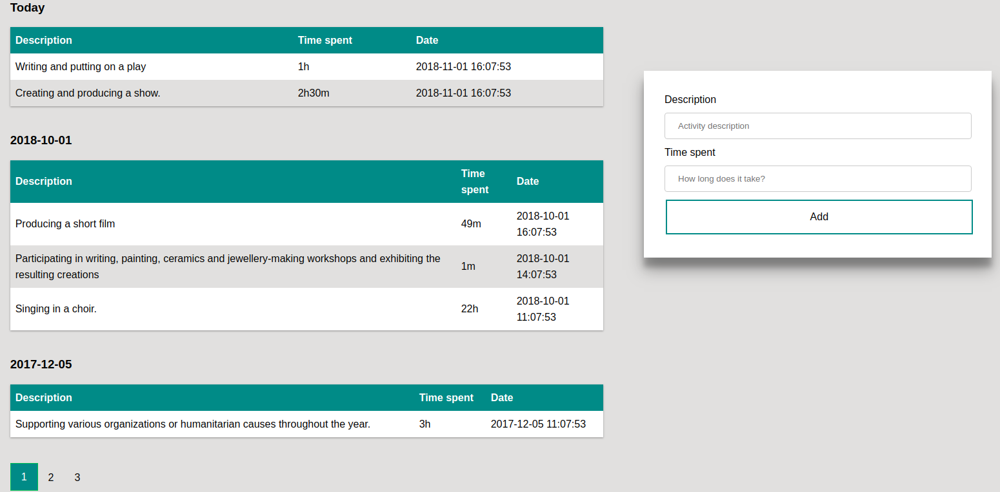

TrackMe :watch: - Scailable big data enterprise :chart_with_upwards_trend: nex-gen robust solution :ok_hand: for time tracking, powered by AI :alien: based on blockchain technologies :wrench: :rocket:



## Requirements

:whale:
```
➜  ~ docker --version
Docker version 18.06.1-ce, build e68fc7a
➜  ~ docker-compose --version
docker-compose version 1.22.0, build f46880fe
```

## Running app
Clone repository and run following command in terminal:
```
mv .env.dist .env && docker-compose up -d && sh composer-install.sh
```

Web UI will be available at http://localhost:8080 :rainbow:
